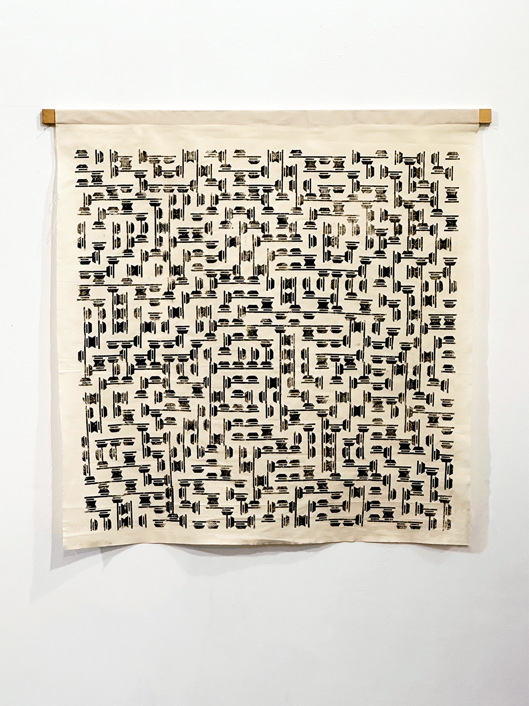
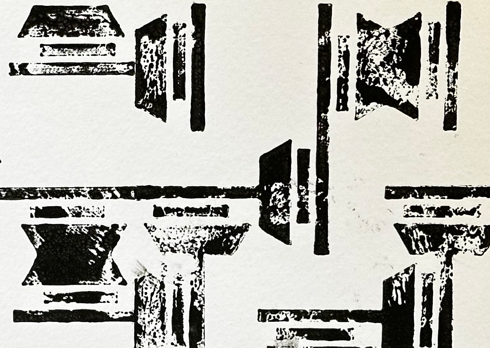

# Pareidolia

_‘Pareidolia’_ is a project that aims to play on our tendency to perceive a recognisable image or shape in a random visual pattern. Inspired by cloud-watching, the artwork encourages viewers to load arbitrary meanings into the shape and patterns created by its patterns. The project starts its life digitally and bridges to an analogue outcome. A code containing only two lines and a polygon is used to create these complicated series of patterns which are then turned into printed stamps. These stamps are used randomly to remove the human input element as much as possible, and to realise the final artwork.

